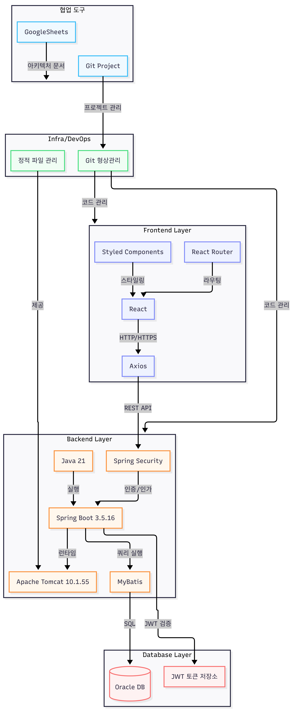
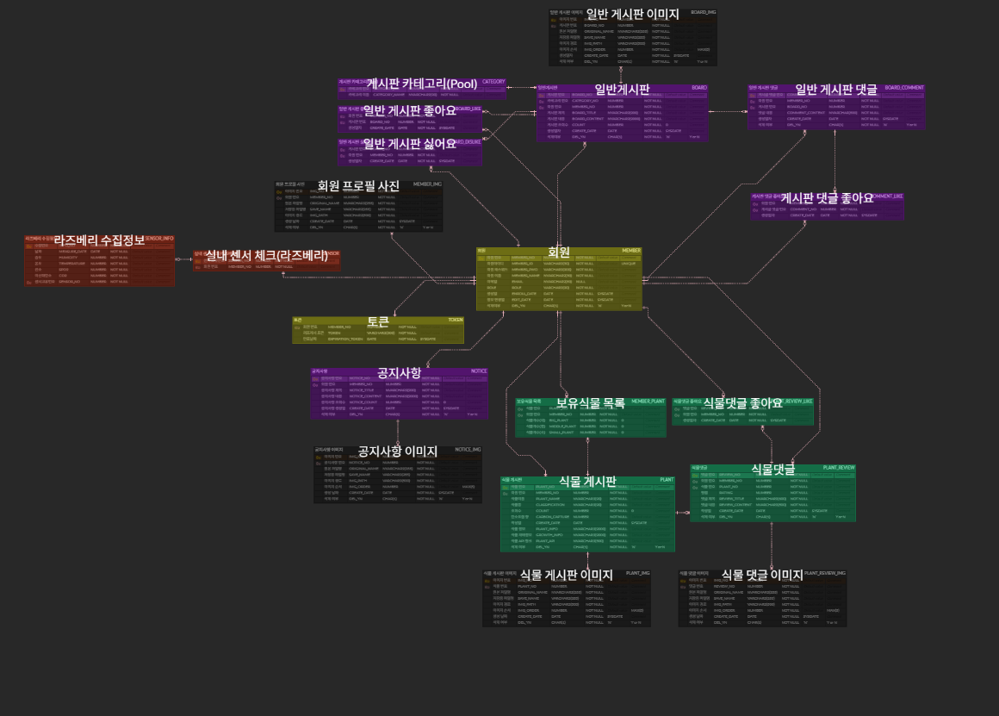

# PlantPlants

> 식물 재배 난이도와 탄소포집 성능을 공유하는 친환경 원예 커뮤니티

## 1. 왜 만들었는지?

기후 변화와 탄소중립에 대한 관심이 높아지는 가운데, 사용자가 보유한 식물을 기반으로 탄소 포집량을 확인하고 환경 기여도를 직관적으로 확인할 수 있는 서비스를 기획했습니다. 식물별 탄소 흡수량 데이터를 활용하여 예상 탄소 포집량을 계산하고, 이를 마이페이지에서 확인할 수 있도록 구현했습니다.

또한 평소 영화 리뷰 사이트를 자주 이용하면서 "식물도 직접 키워본 경험을 바탕으로 다른 사람에게 추천하고 평가를 공유할 수 있으면 좋겠다"​는 아이디어를 제안했고, 이를 서비스에 반영했습니다. 사용자는 식물의 재배 난이도, 생존력, 관리 경험 등을 리뷰하고 다른 사용자의 평가를 참고하여 자신에게 적합한 식물을 선택할 수 있습니다.

이를 통해 탄소 포집량 확인을 핵심 기능으로 제공하면서, 사용자 경험과 정보 공유를 위한 식물 커뮤니티 기능을 함께 갖춘 서비스​를 구현했습니다.

---

## 2. 팀원

**팀명** : Team Agile

| 이름 | GitHub | Email | 담당 | 소개 |
|------|--------|-------|------|------|
| 성현 |  | `koyong3941@gmail.com` | 팀장 | 조직의 목표와 서비스의 책임을 우선적으로 고려하며, 프로젝트의 방향성에 맞는 개발을 지향합니다. |
| 민범 |  | `minbeom0503@naver.com` | 팀원 및 유지보수 | 창조적인 아이디어와 긍정적사고 그리고 인간성 포기하지 않는 마인드로 프로젝트에서 서브적인 역할을 맡고 있습니다!! 어떤 곳을 가도 자신감이 넘칩니다! |
| 세웅 |  | `bill97720@naver.com` | 팀원 | 꾸준한 학습과 기술 습득을 통해 성장하고 있습니다. 협업을 중요하게 생각하며, 팀과 함께 성장하는 개발자가 되고 싶습니다. |
| 일섭 |  | `lno001@hotmail.com` | 팀원 | 팀 내에서 의견 조율을 맡고 있습니다. 이번 프로젝트로 팀원간 협동의 중요성에 대해 배워갔습니다. |

---

## 기술 스택
&nbsp;
&nbsp;
&nbsp;
&nbsp;
&nbsp;
&nbsp;
&nbsp;
&nbsp;
&nbsp;
&nbsp;
&nbsp;

---

## 3. 기간 및 개발 분기

**개발 기간** : 2026.06.15 ~ 2026.07.15

### 개발 분기

- **1주차** : 유스케이스 및 화면 설계, 기본 페이지 구성
- **2주차** : 개발 명세서 작성, ERD 설계, DB 구축
- **3주차** : 로그인/회원가입, 일반 게시판, 식물 게시판 기본 CRUD 구현
- **4주차** : 리뷰·댓글·좋아요, 관리자 기능, 회원 식물 관리, 센서 연동
- **5주차** : QA 테스트 및 발표 준비

---

## 4. 이 프로젝트가 무엇을 하는건지?

**주사용자**  
- 친환경 식물 재배에 관심이 있으며, 식물 정보와 탄소 포집 효과를 함께 관리하고 싶은 사용자

**주요 특징**
- 🌱 식물 등록 및 관리
- 🌍 보유 식물 기반 탄소 포집량 집계
- 📊 식물별 탄소 포집 성능 지표 제공
- 💬 식물 리뷰 및 사용자 평가 기반 정보 공유 커뮤니티
- 🛠️ 관리자 페이지를 통한 식물 및 게시글 관리

---

## 5. 아키텍처 구조

  

**시스템 흐름 설명** 
Frontend Layer: React 기반의 SPA(Single Page Application)로 구현되었으며, Axios를 통해 REST API 요청을 수행합니다.

Backend Application: Spring Boot와 Java 21을 기반으로 구축되었으며, Spring Security를 통해 JWT 기반 인증/인가를 처리합니다.

Database: Oracle Database를 사용하며, MyBatis를 활용하여 데이터 접근 및 영속성을 구현했습니다.

Storage: 업로드된 이미지 파일은 서버의 로컬 저장소에서 관리하며, 데이터는 Oracle Database를 통해 관리합니다.

Infra: Git과 Google Sheets를 통해 협업 및 프로젝트 문서화를 관리합니다.

  

**Database Schema Design** 
본 프로젝트는 유연한 데이터 관리와 높은 확장성을 위해 관계형 데이터베이스(RDBMS)를 기반으로 설계되었습니다. 주요 설계 특징은 다음과 같습니다.

통합 회원 관리: MEMBER 테이블을 중심으로 토큰, 프로필, 활동 내역을 통합 관리하여 일관성 있는 사용자 경험을 제공합니다.

모듈화된 게시판 시스템: 일반 커뮤니티와 식물 특화 게시판을 분리 운영하며, 이미지, 댓글, 좋아요/싫어요 기능을 독립적인 테이블로 설계하여 유지보수 효율성을 극대화했습니다.

### **ERD**  

---

## 6. 주요기능

### MVP 및 주요 페이지별 시나리오

#### 회원 인증 및 MVP(탄소집계) (담당: 윤성현)
- 회원 및 탄소집계 MVP 기능 개발(BE/FE)
  - Spring Security와 JWT 기반 인증 시스템 구현
  - 공기감지 센서 개발 및 연동 구현
  - 사용자 활동 데이터를 기반으로 탄소 포집량 계산 로직 구현
  - 식물별 탄소포집 계수를 적용한 탄소 저감량 산출 기능 개발
  - 마이페이지 내 탄소집계 정보 조회 화면 구현

#### Admin관리자 페이지 및 MVP(공지사항) (담당: 강민범)
- 식물 원예 커뮤니티 중 프론트 엔드 작업에서는 관리자 페이지 작업을 수행했으며 백엔드 작업에서는 공지사항 페이지를 수행하였습니다. 
  - 그와 연동되는 db에서는 다양한 식물의 정보들을 수집 그리고 게시글을 늘리는 작업을 하였습니다. 
  - 아이디어 회의나 중간회의 에서는 탄소포집 측정 부분이나 식물을 키우는 유저들에게 커뮤니티를 활용하여 자연적으로 얻게되는 지식 리뷰 시스템을 통한 식물에 대한 피드백등으로 식물 원예커뮤니티를 활용하면서 얻게 되는 장점들을 토론 했던것 같습니다.

#### 메인페이지 및 MVP(식물, 게시글) (담당: 지세웅)
- 프론트 엔드
  - 식물리스트 페이지, 식물 상세정보 페이지를 구현했습니다
  - 게시글 리스트 페이지, 게시글 상세 페이지, 게시글 작성 페이지, 게시글 수정 페이지를 구현했습니다
  - 메인 페이지, 에러 페이지를 구현했습니다
  - 백엔드에서는 식물 관련, 회원 보유 식물 관련 기능을 구현했습니다

#### 식물 정보 관리 및 MVP(CRUD) (담당: 이일섭)
- 관리자용 식물 정보 관리 및 검색 기능 개발 (BE/FE)
  - 식물 목록을 조회하고 페이지 단위로 나누어 보여주는 기능 구현
  - 식물명, 종류, 작성자 등 여러 조건으로 검색할 수 있는 기능 개발
  - 검색 시 키워드와 검색 대상에 따라 서버에서 동적으로 결과를 조회하도록 구현
  - 선택한 식물을 삭제하거나 복구하는 기능 추가 (실제 삭제가 아닌 상태 변경 방식)
  - React 관리자 화면과 Spring Boot API를 연동하여 검색·선택·삭제까지 동작하게 구현
